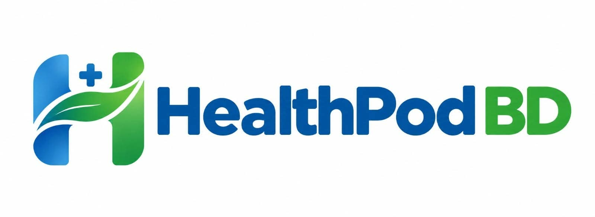
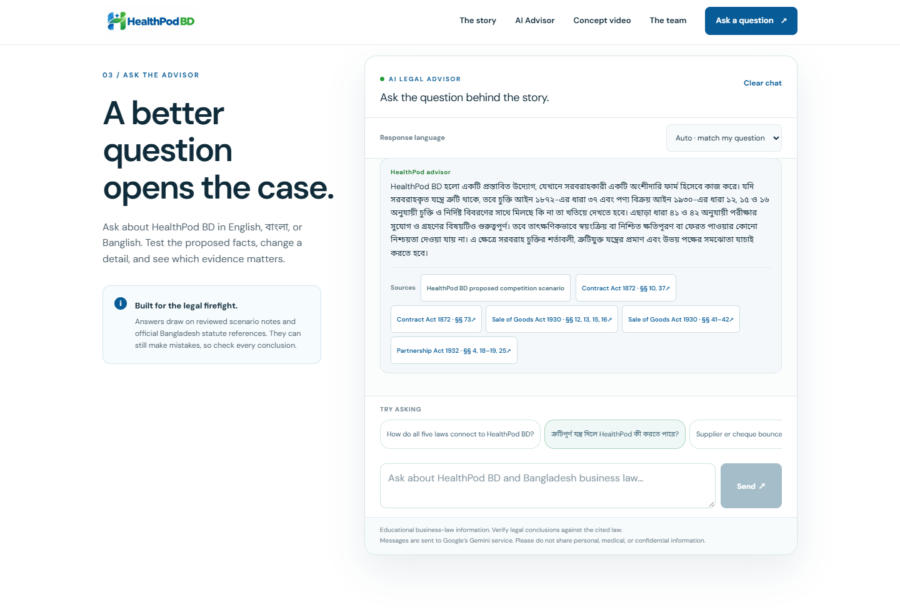
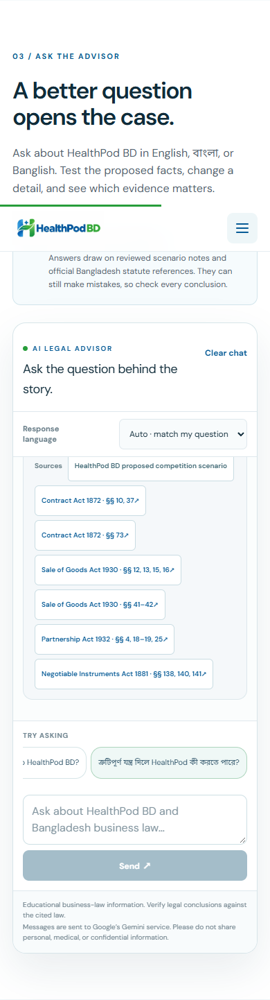
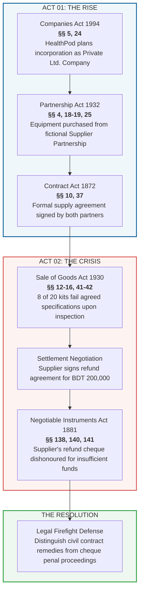
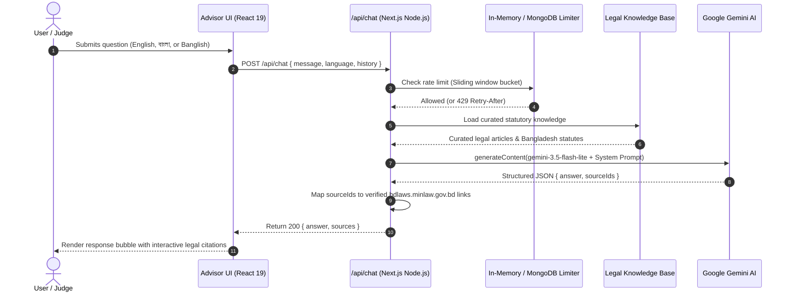
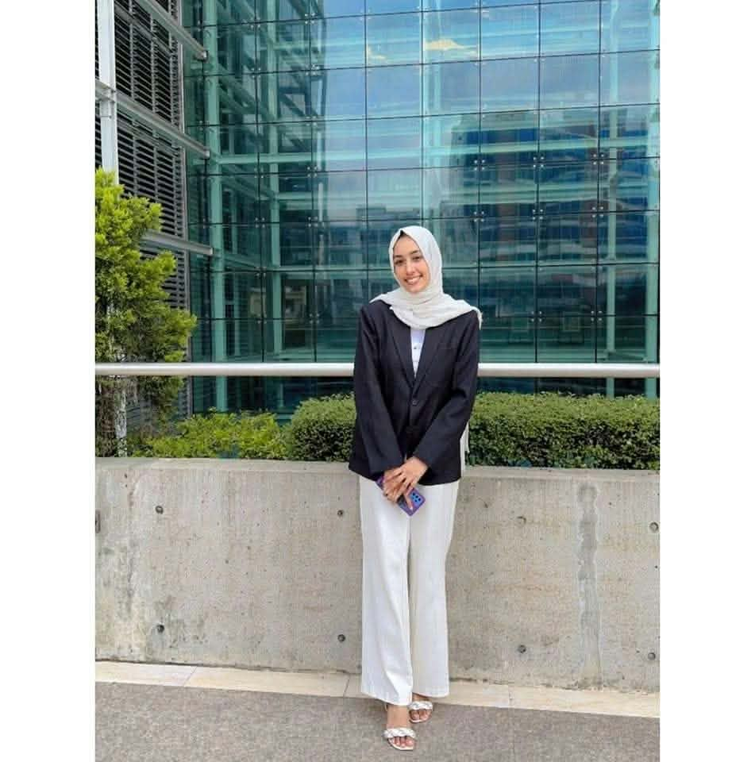

# <p align="center"><br><strong>HealthPod BD</strong></p>

<p align="center">
  <strong>Smart, self-service health check booths for Bangladesh — powered by a Google Gemini AI Legal Advisor.</strong><br>
  <em>Next Venture · Business Law (LAW 4151 / 2106) · United International University</em>
</p>

<p align="center">
  
  
  
  
  
  
</p>

---

## 🌟 Overview

**HealthPod BD** is an innovative business concept and companion platform created for the **UIU Business Law Competition (Summer 2026)**. 

The project envisions self-service health monitoring booths placed in busy Bangladeshi public transit hubs, shopping centers, and universities (for rapid blood pressure, blood glucose, and SpO₂ readings). Accompanying the business story is a **live AI Legal Advisor** designed for competition judges to test how five fundamental Bangladeshi commercial laws govern the company's formation, contracts, equipment crisis, and banking disputes.

---

## 📸 Visual Showcase

### 🤖 Live AI Legal Advisor in Action
The chatbot delivers structured, educationally grounded legal analyses under Bangladesh law, complete with official statutory citations:

<p align="center">
  
</p>

### 📱 Responsive Mobile Experience & 🏁 Scannable QR Code
Designed mobile-first so competition judges and booth visitors can scan the physical X-banner QR code and immediately test the live advisor directly on their smartphones:

<table align="center" border="0">
  <tr>
    <td align="center" valign="middle">
      <br><br>
      <strong>📱 Mobile Advisor Interface</strong>
    </td>
    <td align="center" valign="middle" width="50">&nbsp;</td>
    <td align="center" valign="middle">
      <br><br>
      <strong>📲 Scan with your Phone Camera</strong><br>
      <em>Official Competition X-Banner QR Code</em>
    </td>
  </tr>
</table>

---

## ⚖️ One Story, Five Laws: The Legal Framework

The core competition challenge integrates five distinct Bangladeshi business statutes into a single, cohesive timeline:



---

## 🏗️ System Architecture

The chatbot is built with zero-downtime reliability in mind, gracefully operating with or without external database dependencies:



---

## 🚀 Key Features

- **🌐 Trilingual Support:** Accepts and responds fluently in **English**, **বাংলা script**, or **Banglish** (`Auto`, `en`, `bn`, `banglish`).
- **🛡️ Statutory Citation Verification:** Strictly grounds legal claims in curated provisions from the official [Bangladesh Laws](https://bdlaws.minlaw.gov.bd) repository. If the model references unsupported citations, the response safely falls back.
- **⚡ Resilient Model Architecture:** Configured with Google Gemini 3.5 series (`gemini-3.5-flash-lite`), featuring automatic model fallback to avoid demand-spike interruptions.
- **🔒 Privacy First & Educational Restraint:** Strictly educational—does not diagnose medical readings or guarantee court outcomes. Messages stay in session memory.
- **📱 Fluid & Adaptive Design:** Custom health-tech theme built with Tailwind CSS, supporting desktop, tablet, and mobile viewports with fluid typography.

---

## 🛠️ Getting Started Locally

### Prerequisites
- **Node.js**: `v22.x` (or later)
- **npm**: `v10.x` (or later)
- A **Google Gemini API Key** from [Google AI Studio](https://aistudio.google.com/)

### 1. Clone the repository
```bash
git clone https://github.com/SadatSKD/HealthPod-BD.git
cd HealthPod-BD
```

### 2. Install dependencies
```bash
npm install
```

### 3. Configure environment variables
Create a `.env` file in the root directory:
```
```
*(See `.env.example` for additional optional configurations including MongoDB and YouTube embed links).*

### 4. Run the development server
```bash
npm run dev
```
Open **`http://localhost:3000`** in your browser.

---

## ☁️ Deployment to Vercel

1. Import the repository `SadatSKD/HealthPod-BD` on [Vercel](https://vercel.com).
2. Set the framework to **Next.js**.
3. Add the following Environment Variables in the Vercel dashboard:
   - `GEMINI_API_KEY`: `Your Gemini API Key`
   - `GEMINI_MODEL`: `gemini-3.5-flash-lite`
   - `TRUST_PROXY_HEADERS`: `true`
   - `RATE_LIMIT_SECRET`: `Any secure random string`
4. Click **Deploy**.

---

## 👥 The Next Venture Team

<table align="center">
  <tr>
    <td align="center" width="25%">
      <br>
      <strong>Shifa Akter Mim</strong><br>
      <code>111221166</code>
    </td>
    <td align="center" width="25%">
      <br>
      <strong>Asif Hossain</strong><br>
      <code>111221086</code>
    </td>
    <td align="center" width="25%">
      <br>
      <strong>Tanzir Ahsan Shakib</strong><br>
      <code>1112230189</code>
    </td>
    <td align="center" width="25%">
      <br>
      <strong>Md. Nahidul Islam</strong><br>
      <code>1112230203</code>
    </td>
  </tr>
</table>

---

## 📜 Academic Attribution

- **Course:** Business Law (LAW 4151 / 2106)
- **Section:** B
- **Institution:** United International University (UIU)
- **Term:** Summer 2026
